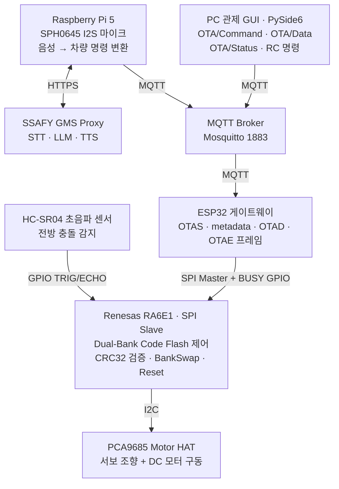

# SDV 시대의 RC카 - 무선 OTA 업데이트와 AI 음성 제어

> SSAFY 임베디드 트랙 15기 · 1학기 관통 PJT
> 팀 구성: 2인 (이승재 + 팀원 1명)

---

## 1. 프로젝트 개요

출고 후에도 소프트웨어 업데이트로 기능이 확장되는 SDV(Software Defined Vehicle) 개념을 RC카 규모로 구현하고, 두 기능을 통합.

- **기능 A - 무선 OTA 업데이트 및 주행 제어**: 제어 MCU 에 무선 모듈이 없어도 게이트웨이(ESP32)를 거쳐 펌웨어를 무선 배포하고, 바뀐 펌웨어가 주행 동작 변화로 이어지는 것까지 시연
- **기능 B - AI 음성 제어**: 사용자 음성을 차량 명령으로 변환하는 인포테인먼트 기능

목표는 보드 분해·재배선 없이 무선 명령만으로 차량 기능을 교체하는 것.

---

## 2. 시스템 아키텍처

명령과 상태 피드백이 MQTT · SPI · I2C·GPIO 경로로 이어지는 구조.



### 통신 경로 요약

| 구간 | 프로토콜 | 용도 |
|------|----------|------|
| GUI ↔ Broker ↔ ESP32 | MQTT | OTA 데이터, RC 조종 명령, 상태 피드백 |
| ESP32 ↔ RA6E1 | SPI + BUSY GPIO | 펌웨어 청크 전달, 명령, 핸드셰이크 |
| RA6E1 ↔ Motor HAT | I2C | 서보·DC 모터 제어 |
| RA6E1 ↔ HC-SR04 | GPIO (TRIG/ECHO) | 전방 거리 측정 |
| Pi5 ↔ GMS | HTTPS | STT / LLM / TTS API |

---

## 3. 기능 A - OTA 업데이트 (Dual-Bank 방식, 최종 채택)

### 3.1 왜 무선 업데이트인가

- **기존 방식**: 버전 교체마다 보드 분해 후 J-Link 케이블 직접 연결. 현장 차량은 분해가 어렵고 잘못 쓰면 보드가 벽돌 상태로 전환
- **OTA 적용 후**: PC 에서 `.bin` 선택 한 번으로 무선 배포, 재배선 없이 기능 교체

### 3.2 Dual-Bank 구조 - 부트로더 없이 갱신

RA6E1 의 1 MiB Code Flash 를 512 KiB × 2 뱅크로 운용. 별도 부트로더 영역이나 애플리케이션 점프 코드 없이 RA6E1 하드웨어의 Dual-Bank 와 시작 뱅크 선택 기능을 사용.

| 논리 주소 | 역할 |
|-----------|------|
| `0x00000000` | 현재 선택된 Active Bank가 매핑되어 CPU가 실행 |
| `0x00200000` | 반대쪽 Inactive Bank 접근용 FSP Dual-Bank alias |

핵심 원리는 **실행 중인 Active Bank 애플리케이션이 스스로 다음 펌웨어를 받아 반대쪽 Inactive Bank 에 기록**하는 것. BankSwap 은 CPU 점프가 아니라 다음 Reset 부터 `0x00000000` 에 매핑될 물리 뱅크를 바꾸는 동작이라, 새 `.bin` 도 `0x00000000` 기준 링크.

다운로드·검증 실패 시 BankSwap 미수행으로 기존 Active Bank 유지.

### 3.3 OTA 실행 순서

1. GUI가 펌웨어 크기·청크 수·전체 CRC32를 담은 `OTA_START` 전송
2. ESP32가 SPI로 `OTAS` + 16바이트 metadata 전달
3. RA6E1이 metadata CRC와 이미지 범위 검사
4. RA6E1이 `0x00200000`의 필요한 Flash 블록만 Erase
5. GUI가 256바이트 청크를 순차 전송
6. ESP32가 각 청크를 `OTAD` SPI 프레임으로 변환
7. RA6E1이 청크 순서·CRC 확인 후 Inactive Bank에 기록
8. 기록 성공한 청크에만 ACK 반환 (실패 시 NACK → 재전송)
9. 모든 청크 완료 후 GUI가 `OTAE` 전송
10. RA6E1 이 누적 수신 바이트와 청크 수를 기대값과 대조 (전체 이미지 CRC 대조는 ESP32 담당)
11. 검증 통과 시에만 `R_FLASH_HP_BankSwap()` 호출
12. `NVIC_SystemReset()` 으로 Reset, 새 뱅크가 `0x00000000` 에 매핑되어 새 펌웨어 실행

### 3.4 안정성 강화 요소

개발 과정에서 발견·해결한 문제와 대응.

- **SPI 동기화 오작동**: RA6E1 이 전송 완료를 기다리지 않고 버퍼를 반복 읽어, 펌웨어 바이너리 속 `w/a/s/d` 바이트가 RC 명령으로 오인되며 모터 임의 동작. `spi_callback()` 에서 `SPI_EVENT_TRANSFER_COMPLETE` 확인 후 진행하도록 blocking 처리하고 OTA 모드 중 RC 명령 차단
- **초기화 데드락**: BUSY 핀(P302) 초기값을 LOW 로 명시하지 않아 ESP32 무한 대기. `hal_entry()` 최상단에서 `SET_BUSY_LOW()` 명시로 해소
- **GUI 크로스스레드 크래시**: MQTT 콜백(백그라운드 스레드)에서 UI 직접 조작으로 충돌. Signal & Slot 패턴으로 메인 스레드에 위임
- **데이터 무결성**: 청크 1개만 깨져도 벽돌화. RA6E1 이 메타데이터·청크 CRC32 를 검증해 불일치 시 거부, ESP32 는 전송 완료 시 전체 이미지 CRC32 를 대조하되 경고만 기록. ARQ 재전송(NACK `0x1F`, 청크당 최대 20회) · Session ID · 바이너리 프로토콜 병행

### 3.5 이 방식의 한계

기록 정상 여부는 검증하나 실제 부팅 성공을 확인해 자동 롤백하는 기능은 부재. 새 뱅크가 부팅되지 않으면 e2 studio 디버거로 정상 펌웨어를 직접 기록해야 함. 보완 수단은 첫 부팅 성공 플래그 · Heartbeat 롤백 · 서명 검증.

---

## 4. 기능 A 부속 - HC-SR04 충돌 회피 (OTA 가치 시연)

같은 RC카에 두 펌웨어를 OTA 로 번갈아 올려 기능 변화를 보이는 시연용 구성.

- **V1.0.0 (업데이트 전)**: HC-SR04 핀 초기화 없음. 전진 중 장애물이 있어도 계속 주행하므로 수동 정지 필요
- **V2.0.0 (업데이트 후)**: 전방 20cm 이내 장애물 감지 시 즉시 정지, 28cm 이상 3회 연속 확인 후 전진 재허용(히스테리시스). 후진은 탈출용으로 항상 허용

| 항목 | 값 |
|------|-----|
| TRIG 핀 | P409 / Arduino D2 |
| ECHO 핀 | P104 / Arduino D3 (5V→3.3V 분압 필수) |
| 정지 거리 | 20cm |
| 해제 거리 | 28cm × 3회 연속 |
| 측정 주기 | 약 60ms, 비차단 상태 머신 |
| 거리 공식 | ECHO HIGH 시간(us) / 58, DWT 사이클 카운터 사용 |

기존 SPI(P100\~P102) · I2C(P400/P401) · BUSY(P302)와 겹치지 않는 핀으로 선정.

---

## 5. 기능 B - AI 음성 제어

라즈베리파이 5 + SPH0645 I2S 마이크로 음성을 캡처하고 SSAFY GMS 프록시를 거쳐 STT → LLM → TTS 파이프라인을 실행하는 Qt GUI.

```
SPH0645 → WAV 녹음 → Whisper STT → LLM → TTS → 스피커 재생
```

- 음성 질문: 기본 5초 녹음 후 전체 과정 자동 실행
- 텍스트 질문: 마이크 없이 LLM·TTS 구간만 시험 가능
- API 키는 소스가 아닌 `.env`에서만 로드
- 원류: 기존 "음성인식 센서 + 라즈베리파이4 음성 RC카 제어 실습"을 ESP32 + RA6E1 구성에 맞게 수정·적용

배선 요점은 SPH0645 가 3.3V 장치(5V 금지)이고 BCLK=GPIO18 · LRCLK=GPIO19 · DOUT=GPIO20 · SEL=GND(Left) 결선. Pi5 는 아날로그 오디오 단자가 없어 USB·HDMI·BT 스피커 별도 필요.

---

## 6. 팀원 간 역할 분배

MQTT·SPI 연동을 축으로 OTA · AI 음성 제어 · RA6E1 주행 펌웨어를 통합.

### 팀원 - OTA 시스템 · AI 음성
- **Dual-Bank OTA 수신·기록·BankSwap 구현** (최종 시연 채택)
- OTA 전송 프로토콜 설계 (256B 청크, CRC32 검증, ARQ 재전송)
- 기존 관제 GUI에 OTA 업로드 화면·진행률 대시보드 확장
- GMS 기반 STT·LLM·TTS AI 음성 기능 (이승재의 라즈베리파이4 음성제어 실습 기반 수정)

### 이승재 - RA6E1 펌웨어 · 무선 제어 체인
- **PySide6 관제 GUI 및 MQTT 명령 발행** (주행 제어 기반 구현)
- **ESP32 게이트웨이**: MQTT 수신 → JSON 파싱 → SPI 1바이트 변환 (`go/back/left/right/mid/stop` → `w/x/a/d/s/f`)
- SPI Slave/BUSY 기반 차량 명령 수신 처리
- MotorHat(PCA9685) I2C 기반 주행·조향 제어 (서보 조향 + DC 구동)
- **HC-SR04 초음파 충돌 회피 펌웨어 직접 작성** (전방 감지 정지, hysteresis 재출발)
- 주행·센서 통합 테스트 및 시연 펌웨어 안정화
- **MCUboot 부트로더 기반 OTA 방식 독립 시도**: 슬롯 교체 검증까지 도달, 무선 전송 미완 (별도 저장소, 아래 참조)

> 무선 제어 체인(GUI → MQTT → ESP32 → SPI → 모터)을 이승재가 먼저 구축하고, 그 위에 팀원이 OTA 전송·Dual-Bank 기록과 AI 음성 기능을 확장. 역할은 나누되 MQTT · SPI · GUI 상태 피드백을 기준으로 통합 검증 반복.

---

## 7. OTA 두 방식의 병행 연구

OTA 는 두 접근을 병행 시도한 뒤 하나를 최종 채택. Dual-Bank(팀원)는 완성해 시연에 사용했고, MCUboot(이승재)는 부트로더 서명 검증과 슬롯 교체까지 도달했으나 실행 중 코드플래시 self-programming 제약으로 무선 전송 미완.

- 두 방식 모두 같은 제약을 다르게 다룸. Dual-Bank 는 하드웨어 뱅크 전환으로 우회, MCUboot 는 정면 대응 후 중단
- MCUboot 방식의 구조·검증 내역·중단 사유 상세는 [rccar-mcuboot-ota](https://github.com/SJLee-83/rccar-mcuboot-ota) 에 독립 정리

---

## 8. 한계와 개선 방향

이번 구현에서 미완으로 남은 기술 항목과 개발 프로세스 공백.

### 8.1 OTA 안전성 - 자동 롤백 부재

Dual-Bank · MCUboot 두 방식 공통 한계. 새 펌웨어의 기록 정상 여부는 검증하나 **실제 부팅 성공을 확인해 실패 시 이전 버전으로 자동 복구하는 기능이 부재**. 새 뱅크·슬롯이 부팅에 실패하면 e2 studio 디버거로 직접 다시 기록해야 하므로 무선의 이점이 사라지고 현장 복구 불가.

개선 방향

- 새 펌웨어 첫 부팅 성공 플래그 (confirm/revert)
- 일정 시간 내 Heartbeat 미수신 시 이전 뱅크로 자동 롤백
- MCUboot 는 Overwrite 대신 swap 모드로 롤백 지원

### 8.2 보안 - 무선 완성과 서명 검증의 트레이드오프

두 방식이 서로 다른 절반씩만 달성.

| | 무선 전송 완성 | 서명 검증 |
|---|:---:|:---:|
| 팀 Dual-Bank (채택) | 완성 | 미적용 (CRC32만) |
| 이승재 MCUboot | 미완 (self-programming 제약) | 적용 (ECDSA P-256) |

채택된 Dual-Bank 는 CRC32 로 전송 오류는 잡으나 악의적 변조는 차단 불가. 서명 없는 무선 OTA 는 임의 펌웨어 주입에 취약하므로, 무선 전송과 서명 검증을 함께 갖춘 구성이 다음 단계.

### 8.3 AI 음성과 차량 제어의 통합도

ai_audio 는 STT → LLM → TTS 파이프라인까지 동작하나, 음성 인식 결과가 차량 제어 명령으로 연결되는 범위가 제한적. 인포테인먼트 응답과 주행 명령 사이 연결이 얕아 음성·비전 기반 명령 확장 여지 존재.

### 8.4 개발 프로세스

- **버전 관리 부재**: 진행 중 git 미사용으로 개발 타임라인·시행착오·기여 이력이 커밋으로 미기록. 결과물을 사후 일괄 업로드
- **통합 테스트 체계 부재**: 통합 검증이 수동 반복에 의존. 자동화 테스트·회귀 검증 없음
- **개선 방향**: git 브랜치 전략 · CI · HIL(Hardware-in-the-Loop) 테스트 도입

### 8.5 self-programming 미해결

MCUboot 방식에서 앱이 실행 중 코드플래시에 직접 쓰는 구간(C-7b)이 RAM 실행 이슈로 미완. 상세는 MCUboot 정리 문서 참조.

---

## 9. 시연 구성

발표 시연은 세 장면으로 구성.

- **DEMO 01 OTA 시연**: GUI → MQTT → ESP32 → SPI → RA6E1 무선 펌웨어 교체
- **DEMO 02 OTA 대시보드**: 진행률·로그 실시간 갱신
- **DEMO 03 AI 음성 제어**: 발화 → 차량 명령 변환

각 시연 영상 별도 보유.
